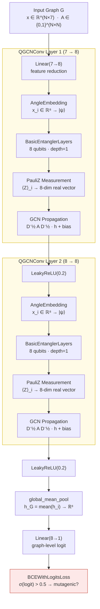
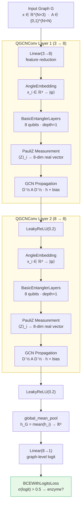

# QGCN Architecture — Mermaid Diagrams

## MUTAG (7-dim node features)

## PROTEINS (3-dim node features)

## Dataset Comparison Table

| Property | MUTAG | PROTEINS |
|---|---|---|
| Graphs | 187 | 1,113 |
| Node feat dim | 7 | 3 |
| Feature reduction | Linear(7→8) | Linear(3→8) |
| Qubits | 8 | 8 |
| Task | mutagenic? | enzyme? |
| Batch size | 16 | 32 |
